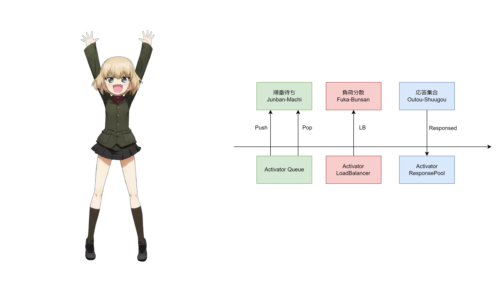

# Katyusha - Катюша - カチューシャ

### (Snowdrift Katyusha - Tuyết Phong Katyusha - 地吹雪のカチューシャ)

[]()
[](https://www.apache.org/licenses/LICENSE-2.0)

[](https://kubernetes.io/)
[]()
[](https://knative.dev/docs/)
[](https://go.dev/)
[](https://protobuf.dev/)

`Katyusha-sama` is the Load Balancing Module of the [ikukantai Fleet](https://github.com/bonavadeur/ikukantai).


## 1. Motivation

`katyusha` supports deploying Load-Balancing Algorithm in `ikukantai` Fleet without deeping into Knative source code.

The name `katyusha` is inspired by the character **Katyusha** in the anime **Girls und Panzer**. `katyusha` and [nonna](https://github.com/bonavadeur/nonna) form a complete Load Balancing system for the `ikukantai` Fleet. This Load Balancing system uses piggybacking mechanism to update load status as fast as possible, much like how **Nonna** always carries **Katyusha** on her back in anime **Girls und Panzer**.

`katyusha` is also inspired by the **Soviet BM-13 Katyusha rocket launcher** in the Great Patriotic War (just like Katyusha in Girls und Panzer). Our Load Balancing system operates as efficiently and powerfully as Katyusha!

According to the anime **Girls und Panzer**, the character **Katyusha** really hates speaking Russian and always demands team members speak Japanese. Therefore, some prominent Golang structs and packages in this source code are named in Japanese! 日本語を話してくださいよ！！！

## 2. Structure



## 3. Installation

### 3.1. Requirement

+ [ikukantai](https://github.com/bonavadeur/ikukantai?tab=readme-ov-file#3-installation) Fleet is deployed, version >= 2.2
+ [Go](https://go.dev/doc/install) is installed, version >= 1.22.4
+ [Docker]() is installed. `docker` command can be invoked without sudo
+ [upx](https://upx.github.io/) is installed, version >= 4.2.4

### 3.2. Config `katyusha` as image of Activator

Let's assume that the nodes in your cluster are named **node1**, **node2**, **node3**. See `spec.template.spec.affinity` to fill this information into the [activator-deployment.yaml](config/activator-deployment.yaml) file correctly.

Change Activator from deployed as DaemonSet to Deployment

```bash
$ kubectl -n knative-serving delete daemonset activator
$ kubectl apply -f config/activator-deployment.yaml
```

New raising Activator will deployed with image `katyusha:dev`

```bash
$ kubectl -n knative-serving get deploy activator -o yaml | grep image:
        image: docker.io/bonavadeur/katyusha:dev
```

### 3.3. Add configs to Configmap for Katyusha

`katyusha` uses these configs in ConfigMap **config-ikukantai** in namespace **knative-serving**:

| Config | Description | Value | Example |
|-|-|-|-|
| **ikukantai-enable-katyusha** | enable/disable `katyusha` | bool | "true", "false" |
| **katyusha-threads** | number of processing threads in `katyusha` | integer | "10" |
| **katyusha-enable-junbanmachi** | enable/disable Layer-1 Queuing feature | bool | "true", "false" |
| **katyusha-enable-fukabunsan** | enable/disable Load Balancing feature | bool | "true", "false" |
| **katyusha-enable-outoushuugou** | enable/disable Response Pool feature | bool | "true", "false" |
| **katyusha-junbanmachi-concurrent-request** | number of concurrent request in Layer-1 Queue | integer | "10" |

Example:

```yaml
apiVersion: v1
kind: ConfigMap
metadata:
  name: config-ikukantai
  namespace: knative-serving
...
data:
  ...
  ikukantai-enable-katyusha: 'true'
  katyusha-enable-fukabunsan: 'true'
  katyusha-enable-junbanmachi: 'true'
  katyusha-enable-outoushuugou: 'true'
  katyusha-junbanmachi-concurrent-request: '10'
  katyusha-threads: '10'
  ...
```

## 4. Development

First, apply a demo application for `nonna` development:

```bash
$ kubectl apply -f config/hello.yaml
```

Take a look in [build.sh](./build.sh). There are two options for building `katyusha` image:
+ **ful**: build `katyusha` image from source, fastly but large size of image
+ **push**: like **ful** options, but slower and smaller size of image because the compression level is increased and then image will be pushed to the registry

```bash
$ ./build.sh ful # faster but larger image size
$ ./build.sh push # slower but smaller image size
```

## 5. Author

Đào Hiệp - Bonavadeur - ボナちゃん  
The Future Internet Laboratory, Room E711 C7 Building, Hanoi University of Science and Technology, Vietnam.  
未来のインターネット研究室, C7 の E ７１１、ハノイ百科大学、ベトナム。  


