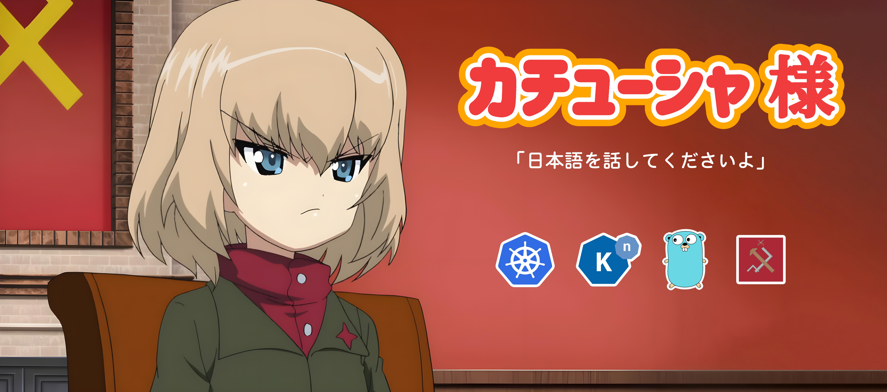

# Katyusha - Катюша - カチューシャ

### (Snowdrift Katyusha - Tuyết Phong Katyusha - 地吹雪のカチューシャ)

`Katyusha-sama` is the Load Balancing Module of the [ikukantai Fleet](https://github.com/bonavadeur/ikukantai).

## 1. Motivation

`katyusha` supports deploying Load-Balancing Algorithm in `ikukantai` Fleet without deeping into Knative source code.

The name `katyusha` is inspired by the character **Katyusha** in the anime **Girls und Panzer**. `katyusha` and [nonna](https://github.com/bonavadeur/nonna) form a complete Load Balancing system for the `ikukantai` Fleet. This Load Balancing system uses piggybacking mechanism to update load status as fast as possible, much like how **Nonna** always carries **Katyusha** on her back in anime **Girls und Panzer**.

`katyusha` is also inspired by the **Soviet BM-13 Katyusha rocket launcher** in the Great Patriotic War (just like Katyusha in Girls und Panzer). Our Load Balancing system operates as efficiently and powerfully as Katyusha!

According to the anime **Girls und Panzer**, the character **Katyusha** really hates speaking Russian and always demands team members speak Japanese. Therefore, some prominent Golang structs and packages in this source code are named in Japanese! 日本語を話してくださいよ！！！

## 2. Structure

## 3. Installation

## 4. Development

## 5. Author

Đào Hiệp - Bonavadeur - ボナちゃん  
The Future Internet Laboratory, Room E711 C7 Building, Hanoi University of Science and Technology, Vietnam.  
未来のインターネット研究室, C7 の E ７１１、ハノイ百科大学、ベトナム。  

